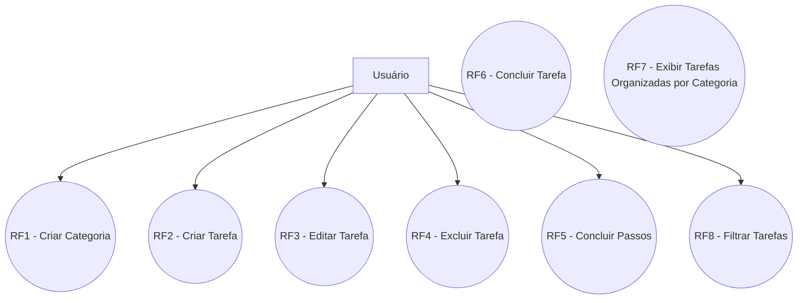
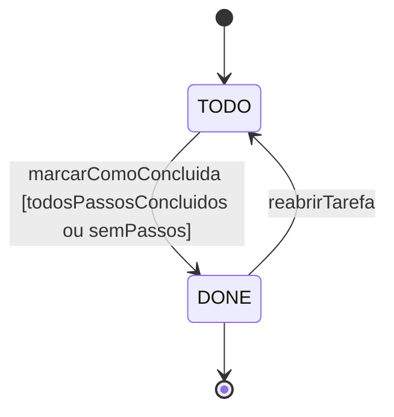
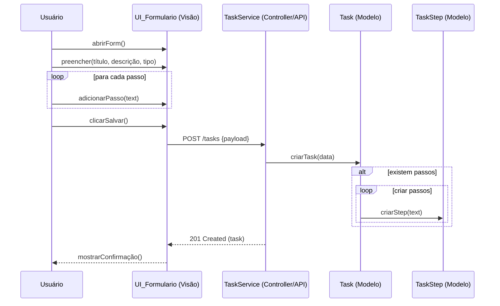
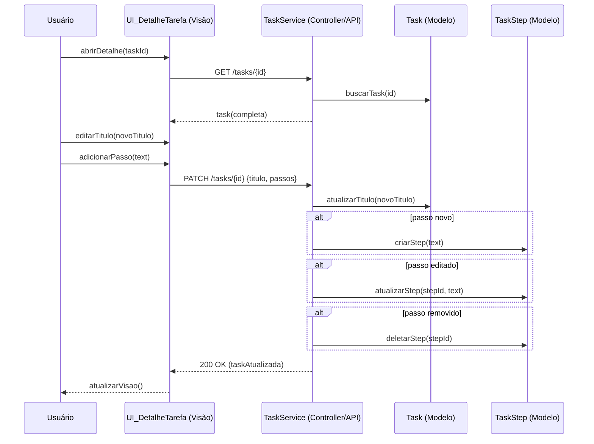
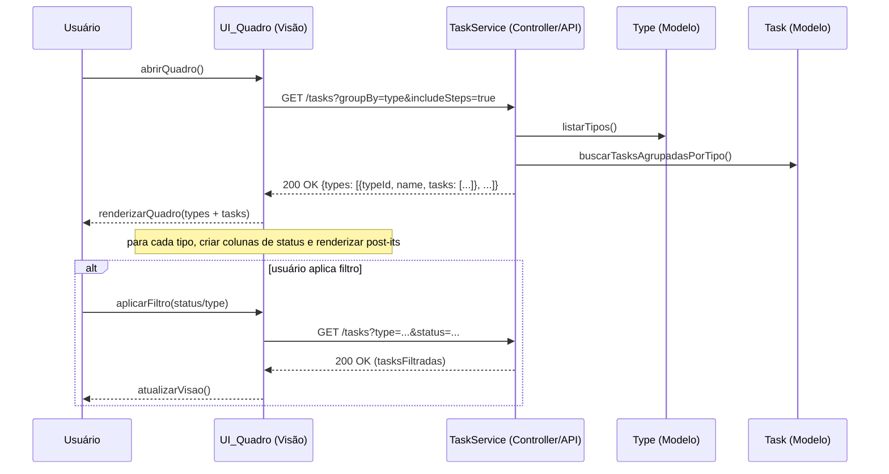
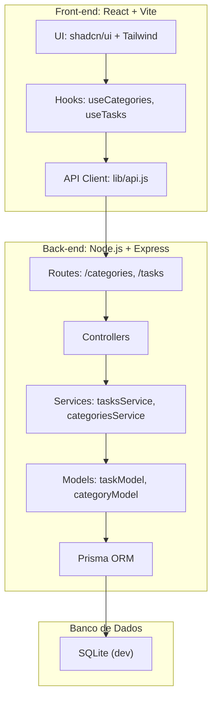

## REQUISITOS - Organizador de Tarefas

Autor: Lucas Duan Rodrigues

---

## 1. Identificação do Produto

- Nome do produto: Organizador de Tarefas
- Autoria: Projeto solo (desenvolvedor único)
- Público-alvo: Pessoas em geral que buscam uma forma simples e visual de organizar e acompanhar tarefas do dia-a-dia (tarefas domésticas, limpeza, compras, projetos pessoais, etc.)
- Plataforma alvo: Web. Back-end implementado com Node.js + Express + Prisma + SQLite. Front-end: Vite + React.

## 2. Missão do Produto

Apoiar usuários na organização e visualização de tarefas do dia a dia por meio de uma interface visual, permitindo criação, edição, exclusão e acompanhamento de tarefas com passos (subitens), tipos personalizáveis e status (A Fazer, Feito), de maneira simples e intuitiva.

## 3. Escopo do Sistema (Limites do Produto)

Limites:

- Não há suporte a pagamentos, faturamento ou integrações financeiras.
- Backup/restore gerenciado não será provido; administração do banco de dados fica a cargo do usuário/infraestrutura.
- Não haverá integração com calendários externos.
- Suporte para uso por um único usuário.
- Não haverá sincronização em tempo real entre múltiplos dispositivos.

Premissas:

- O usuário utiliza um navegador moderno.
- Banco de dados PostgreSQL (produção) ou SQLite (desenvolvimento).
- Front-end usará shadcn/ui e Tailwind (ou CSS) para aparência de post-its.

## 4. Usuários e Sistemas Externos

Usuários:

- Usuário Comum: cria, edita, apaga e organiza tarefas; cria tipos de tarefas; marca passos como feitos.

Sistemas Externos:

- Sistema de Persistência: PostgreSQL / SQLite via Prisma.

## 5. Modelo de Processo do Software

Desenvolvimento Incremental (dirigido a planos/ágil).

Justificativa: permite entregar versões incrementais, aceitar mudanças ágeis de requisitos visuais e comportamentais, e facilitar iterações rápidas com teste e feedback. Planejar sprints curtos (1–2 semanas) com incrementos: (1) API/DB e modelos; (2) CRUD básico + UI; (3) passos e tipos dinâmicos; (4) organização por tipo/status e melhorias de UX.

## 6. Requisitos Funcionais (RF)

RF1 — Criar Categoria

- Descrição: Usuário cria uma categoria, a qual permitirá a criação de tarefas dentro dela.

RF2 — Criar Tarefa

- Descrição: Usuário cria uma tarefa, definindo nome principal (título), descrição opcional, tipo (categoria) e passos (lista de subitens).

RF3 — Editar Tarefa

- Descrição: Usuário modifica passos de uma tarefa existente.

RF4 — Excluir Tarefa

- Descrição: Usuário remove uma tarefa ou passos dela.

RF5 — Concluir Passos

- Descrição: Usuário define passos como concluídos.

RF6 — Concluir Tarefa

- Descrição: Sistema define tarefa como concluída quando todos os passos forem concluídos.

RF7 — Exibir Tarefas Organizadas por Tipo e Status

- Descrição: Visualização organiza tarefas por categoria.

RF8 — Filtrar Tarefas

- Descrição: Usuário filtra tarefas por categoria.

## 7. Casos de Uso

Diagrama de Casos de Uso (Mermaid):



Observação: Os casos de uso `RF6 - Concluir Tarefa` e `RF7 - Exibir Tarefas Organizadas por Categoria` são processos que podem ser disparados pelo sistema e, portanto, não possuem um ator humano direto no diagrama.

## 8. Diagrama de Classes & Modelo de Dados

Entidades principais:

1. Task (Tarefa)

- id: string (CUID, chave primária)
- title: string (obrigatório)
- description: string (opcional)
- status: string (padrão: "TODO", valores: "TODO", "DONE")
- typeId: string (FK -> Type, opcional, SetNull ao deletar tipo)
- createdAt: datetime (padrão: now)
- updatedAt: datetime (auto-atualizado)

2. TaskStep (Passo)

- id: string (CUID, chave primária)
- taskId: string (FK -> Task, obrigatório, Cascade ao deletar tarefa)
- text: string (obrigatório)
- done: boolean (padrão: false)
- createdAt: datetime (padrão: now)
- updatedAt: datetime (auto-atualizado)

3. Type (Tipo/Categoria)

- id: string (CUID, chave primária)
- name: string (único globalmente)
- color: string (opcional, para UI)
- createdAt: datetime (padrão: now)
- updatedAt: datetime (auto-atualizado)

Relacionamentos:

- Task 1..N TaskStep
- Task optional -> Type (N tasks por type, SetNull ao deletar)

Schema Prisma (implementado):

```prisma
model Type {
  id        String   @id @default(cuid())
  name      String   @unique
  color     String?
  tasks     Task[]
  createdAt DateTime @default(now())
  updatedAt DateTime @updatedAt

  @@map("types")
}

model Task {
  id          String     @id @default(cuid())
  title       String
  description String?
  status      String     @default("TODO")
  typeId      String?
  type        Type?      @relation(fields: [typeId], references: [id], onDelete: SetNull)
  steps       TaskStep[]
  createdAt   DateTime   @default(now())
  updatedAt   DateTime   @updatedAt

  @@map("tasks")
}

model TaskStep {
  id        String   @id @default(cuid())
  task      Task     @relation(fields: [taskId], references: [id], onDelete: Cascade)
  taskId    String
  text      String
  done      Boolean  @default(false)
  createdAt DateTime @default(now())
  updatedAt DateTime @updatedAt

  @@map("task_steps")
}
```

**Observações sobre a implementação:**

- IDs utilizam CUID em vez de UUID
- Status é string em vez de enum (armazenado como "TODO" ou "DONE")
- Banco de dados SQLite para desenvolvimento (configurável via `.env`)
- Mapeamento de tabelas customizado (`@@map`)
- Relacionamento Task -> Type com `onDelete: SetNull` (tarefa fica sem categoria se categoria for deletada)
- Relacionamento Task -> TaskStep com `onDelete: Cascade` (passos são deletados quando tarefa é deletada)

## 9. Requisitos Não-Funcionais (RNF)

RNF1 — Performance

- A UI deve carregar a lista de tarefas iniciais em < 1s.

RNF2 — Escalabilidade

- Projetar modelos para permitir novas funcionalidades sem mudanças lógicas.

RNF3 — Usabilidade

- UI responsiva e visualmente limpa e intuitiva.

RNF4 — Acessibilidade

- Elementos de formulários com labels, contraste suficiente, navegação por teclado básica.

## 10. Diagrama de Transição de Estados — `Task` (Tarefa)

O diagrama abaixo descreve o ciclo de vida de um objeto `Task` em resposta a eventos do sistema e ações do usuário. O atributo de interesse é `status`, que possui dois estados possíveis e determina o comportamento do objeto.

Descrição rápida:

- Estado inicial: tarefa criada entra no estado `TODO`.
- Estados principais: `TODO`, `DONE`.
- Transição: usuário marca todos os passos como concluídos → tarefa transiciona para `DONE`.

Diagrama (Mermaid - State Diagram):



Explicações:

- `marcarComoConcluida`: evento disparado quando todos os passos de uma tarefa são marcados como concluídos, ou quando uma tarefa sem passos é marcada como feita.
- `reabrirTarefa`: permite voltar de `DONE` para `TODO` se o usuário desejar.
- Condição `[todosPassosConcluidos ou semPassos]`: a transição para `DONE` só ocorre se todos os passos estão concluídos ou se a tarefa não possui passos.

**Nota sobre implementação simplificada:**

A implementação atual possui apenas dois estados (`TODO` e `DONE`) em vez dos três estados planejados (`TODO`, `IN_PROGRESS`, `DONE`). O estado `IN_PROGRESS` foi removido para simplificar o fluxo inicial, podendo ser adicionado em versões futuras se necessário.

## 11. Diagrama de Atividades — RF2: Criar Tarefa

O diagrama de atividades a seguir descreve o fluxo completo do requisito funcional RF2 (Criar Tarefa). Ele representa decisões (nó de decisão), laços (adicionar múltiplos passos), validação e caminhos de erro, além do fluxo de sucesso que persiste a tarefa e atualiza a interface.

Elementos presentes:

- Nó inicial e final
- Ações (abrir formulário, preencher campos, salvar)
- Decisão (validação do título, validação do servidor)
- Laço/ fluxo repetitivo para adicionar passos

Diagrama (Mermaid - Activity / Flowchart):


## 12. Diagramas de Sequência

Diagrama 1 — RF2: Criar Tarefa

Descrição: sequência desde o usuário abrindo o formulário até o servidor persistir a tarefa com seus passos e retornar confirmação.



Diagrama 2 — RF4: Editar Tarefa / Gerenciar Passos

Descrição: sequência para editar título, adicionar/editar/remover passos e persistir alterações.



Diagrama 3 — RF7: Exibir Tarefas Organizadas por Tipo e Status

Descrição: sequência para exibir o quadro principal organizado por tipos (categorias) e, dentro de cada tipo, por status (A Fazer / Feito). O diagrama mostra a solicitação da visão à API, a agregação no serviço e o retorno das tarefas agrupadas.



## 13. Arquitetura de Software

Visão por componentes:



**Stack Implementado:**

- **Back-end:** Node.js + Express.js
- **ORM:** Prisma (v5+)
- **Banco de dados:** SQLite (desenvolvimento)
- **Autenticação:** Nenhuma (usuário único)
- **Validação:** Server-side via services
- **API:** REST com endpoints CRUD para tarefas, categorias e passos

## 14. Modelo Entidade-Relacionamento (E-R)

### Entidades e Atributos

1. **Type (Categoria)**

- **id** (PK, CUID)
- **name** (string, NOT NULL, UNIQUE)
- **color** (string, opcional, para UI)
- createdAt (timestamp, default now)
- updatedAt (timestamp, auto-atualizado)

2. **Task (Tarefa)**

- **id** (PK, CUID)
- **title** (string, NOT NULL)
- **description** (string, opcional)
- **status** (string, default "TODO", valores: "TODO", "DONE")
- **typeId** (FK → Type.id, opcional, SetNull ao deletar categoria)
- createdAt (timestamp, default now)
- updatedAt (timestamp, auto-atualizado)

3. **TaskStep (Passo)**

- **id** (PK, CUID)
- **taskId** (FK → Task.id, NOT NULL, Cascade ao deletar tarefa)
- **text** (string, NOT NULL)
- **done** (boolean, default false)
- createdAt (timestamp, default now)
- updatedAt (timestamp, auto-atualizado)

### Relacionamentos e Cardinalidades

- Type 1 --- N Task (toda tarefa pertence a uma categoria; exclusão de categoria deixa tarefa sem categoria via SetNull).
- Task 1 --- N TaskStep (todo passo pertence a uma tarefa; exclusão de tarefa remove passos via Cascade).

### Mapeamento de Tabelas

- Type → tabela `types`
- Task → tabela `tasks`
- TaskStep → tabela `task_steps`

```

```
