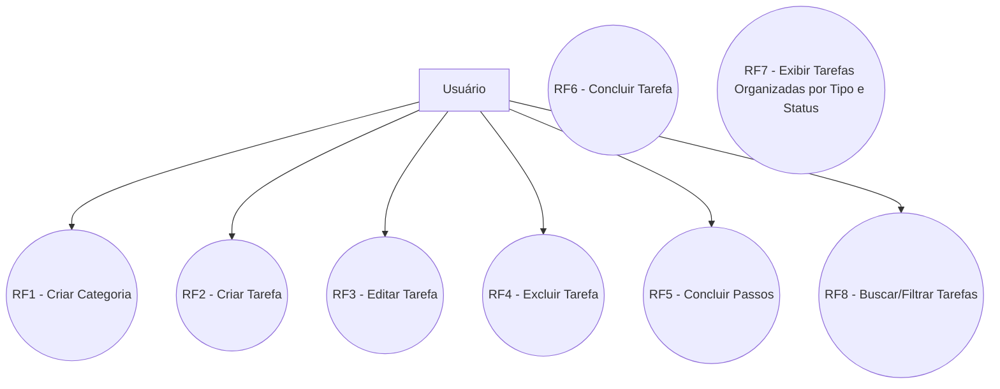
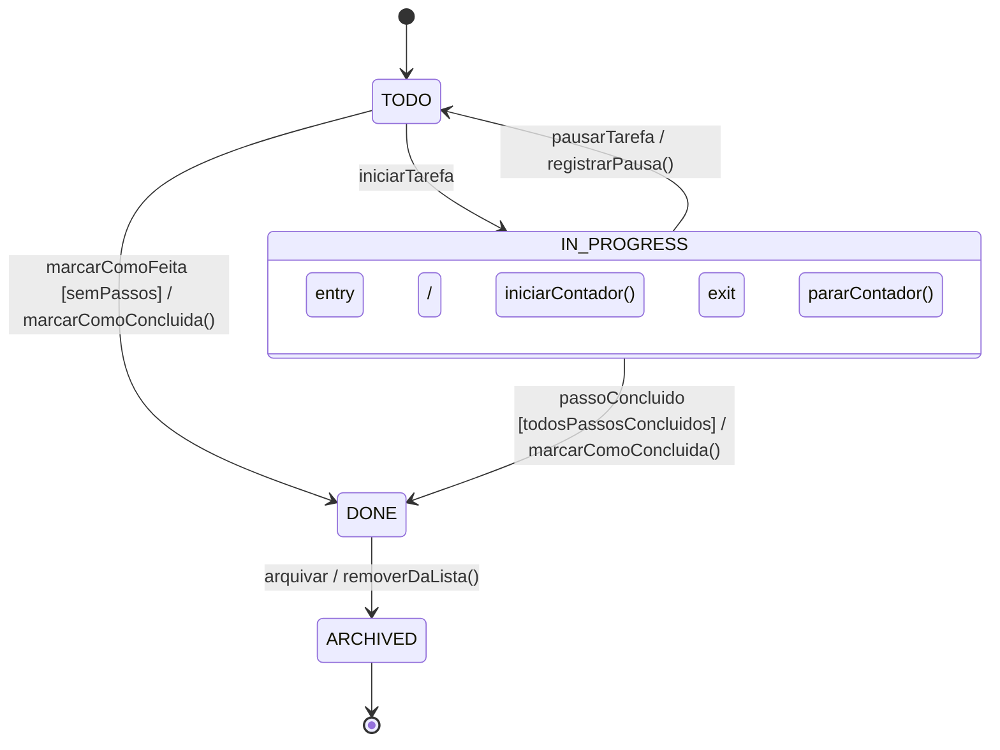
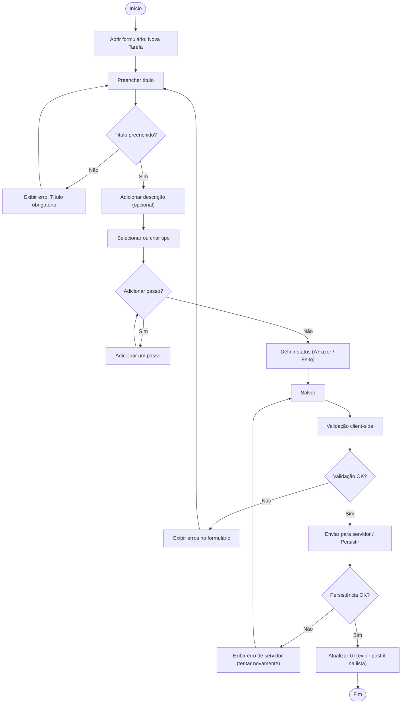
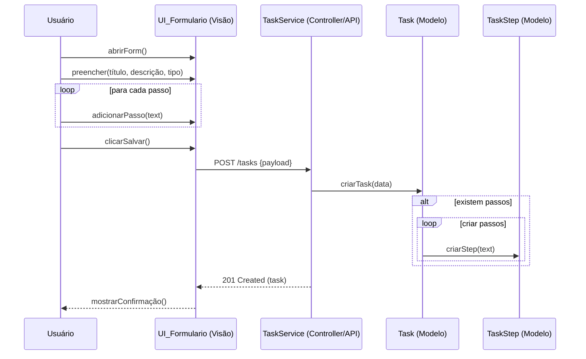
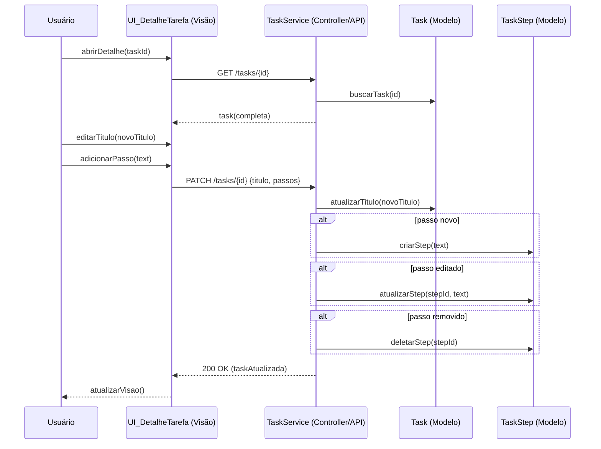
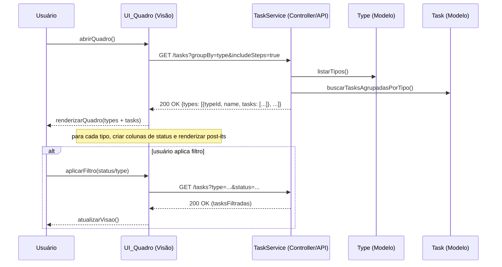

## REQUISITOS - Organizador de Tarefas

Autor: Lucas Duan Rodrigues

---

## 1. Identificação do Produto

- Nome do produto: Organizador de Tarefas
- Autoria: Projeto solo (desenvolvedor único)
- Público-alvo: Pessoas em geral que buscam uma forma simples e visual de organizar e acompanhar tarefas do dia-a-dia (tarefas domésticas, limpeza, compras, projetos pessoais, etc.)
- Plataforma alvo: Web (front-end em Vite + React; back-end em TypeScript + Prisma; banco de dados: PostgreSQL em produção ou SQLite para desenvolvimento/local)

## 2. Missão do Produto

Apoiar usuários na organização e visualização de tarefas do dia a dia por meio de uma interface visual, permitindo criação, edição, exclusão e acompanhamento de tarefas com passos (subitens), tipos personalizáveis e status (A Fazer, Feito), de maneira simples e intuitiva.

## 3. Escopo do Sistema (Limites do Produto)

Limites:

- Não há suporte a pagamentos, faturamento ou integrações financeiras.
- Backup/restore gerenciado não será provido; administração do banco de dados fica a cargo do usuário/infraestrutura.
- Não haverá integração com calendários externos.
- Suporte para uso por um único usuário.
- Não haverá sincronização em tempo real entre múltiplos dispositivos.

Premissas:

- O usuário utiliza um navegador moderno.
- Banco de dados PostgreSQL (produção) ou SQLite (desenvolvimento).
- Front-end usará shadcn/ui e Tailwind (ou CSS) para aparência de post-its.

## 4. Usuários e Sistemas Externos

Usuários:

- Usuário Comum: cria, edita, apaga e organiza tarefas; cria tipos de tarefas; marca passos como feitos.

Sistemas Externos:

- Sistema de Persistência: PostgreSQL / SQLite via Prisma.

## 5. Modelo de Processo do Software

Desenvolvimento Incremental (dirigido a planos/ágil).

Justificativa: permite entregar versões incrementais, aceitar mudanças ágeis de requisitos visuais e comportamentais, e facilitar iterações rápidas com teste e feedback. Planejar sprints curtos (1–2 semanas) com incrementos: (1) API/DB e modelos; (2) CRUD básico + UI; (3) passos e tipos dinâmicos; (4) organização por tipo/status e melhorias de UX.

## 6. Requisitos Funcionais (RF)

RF1 — Criar Categoria

- Descrição: Usuário cria uma categoria, a qual permitirá a criação de tarefas dentro dela.

RF2 — Criar Tarefa

- Descrição: Usuário cria uma tarefa, definindo nome principal (título), descrição opcional, tipo (categoria) e passos (lista de subitens). Pode definir status inicial (A Fazer / Feito), e caso não o faça, ficará como A fazer até todos os passos serem concluídos.

RF3 — Editar Tarefa

- Descrição: Usuário modifica título, descrição, tipo e passos de uma tarefa existente.

RF4 — Excluir Tarefa

- Descrição: Usuário remove uma tarefa ou passos dela.

RF5 — Concluir Passos

- Descrição: Usuário define passos como concluídos.

RF6 — Concluir Tarefa

- Descrição: Sistema define tarefa como concluída quando todos os passos forem concluídos.

RF7 — Exibir Tarefas Organizadas por Tipo e Status

- Descrição: Visualização organiza tarefas por tipo, e dentro de cada tipo sub-organiza por status (A Fazer / Feito).

RF8 — Buscar/Filtrar Tarefas

- Descrição: Usuário pesquisa por tarefas por título ou as filtra por tipo e status.

## 7. Casos de Uso

Diagrama de Casos de Uso (Mermaid):



Observação: Os casos de uso `RF6 - Concluir Tarefa` e `RF7 - Exibir Tarefas Organizadas por Tipo e Status` são processos que podem ser disparados pelo sistema (por exemplo, conclusão automática ao terminar todos os passos; atualização periódica/trigger de organização) e, portanto, não possuem um ator humano direto no diagrama.

## 8. Diagrama de Classes & Modelo de Dados

Entidades principais:

1. Task (Tarefa)

- id: UUID
- title: string (obrigatório)
- description: string (opcional)
- status: enum {TODO, DONE}
- typeId: FK -> Type (opcional)
- createdAt: datetime
- updatedAt: datetime

2. TaskStep (Passo)

- id: UUID
- taskId: FK -> Task
- text: string (obrigatório)
- done: boolean
- createdAt, updatedAt

3. Type (Tipo/Categoria)

- id: UUID
- name: string (único por usuário/instância)
- color?: string (opcional, para UI)
- createdAt, updatedAt

Relacionamentos:

- Task 1..N TaskStep
- Task optional -> Type (N tasks por type)

Esboço de schema Prisma (exemplo):

```prisma
model Task {
  id          String     @id @default(uuid())
  title       String
  description String?
  status      TaskStatus @default(TODO)
  typeId      String?
  type        Type?  @relation(fields: [typeId], references: [id])
  steps       TaskStep[]
  createdAt   DateTime   @default(now())
  updatedAt   DateTime   @updatedAt
}

model TaskStep {
  id        String   @id @default(uuid())
  task      Task     @relation(fields: [taskId], references: [id])
  taskId    String
  text      String
  done      Boolean  @default(false)
  createdAt DateTime @default(now())
  updatedAt DateTime @updatedAt
}

model Type {
  id        String   @id @default(uuid())
  name      String
  color     String?
  tasks     Task[]
  createdAt DateTime @default(now())
  updatedAt DateTime @updatedAt

  @@unique([name])
}

enum TaskStatus {
  TODO
  IN_PROGRESS
  DONE
}
```

## 9. Requisitos Não-Funcionais (RNF)

RNF1 — Performance

- A UI deve carregar a lista de tarefas iniciais em < 1s.

RNF2 — Escalabilidade

- Projetar modelos para permitir novas funcionalidades sem mudanças lógicas.

RNF3 — Usabilidade

- UI responsiva e visualmente limpa e intuitiva.

RNF4 — Acessibilidade

- Elementos de formulários com labels, contraste suficiente, navegação por teclado básica.

## 10. Diagrama de Transição de Estados — `Task` (Tarefa)

O diagrama abaixo descreve o ciclo de vida de um objeto `Task` em resposta a eventos do sistema e ações do usuário. O atributo de interesse é `status`, que possui múltiplos estados possíveis e determina o comportamento do objeto.

Descrição rápida:

- Estado inicial: tarefa criada entra no estado `TODO`.
- Estados principais: `TODO`, `IN_PROGRESS`, `DONE`, `ARCHIVED`.
- Estado final/arquivado: `ARCHIVED` representa que a tarefa foi retirada do fluxo ativo.

Transições incluem eventos, condições de guarda e ações realizadas na transição.

Diagrama (Mermaid - State Diagram):



Explicações:

- `iniciarTarefa`: evento disparado quando o usuário inicia o trabalho na tarefa; executa `registrarInicio()` como ação de entrada.
- `pausarTarefa`: permite voltar de `IN_PROGRESS` para `TODO` (por exemplo, suspender a execução).
- `passoConcluido`: evento que ocorre quando um passo da tarefa é marcado como concluído; a transição para `DONE` só ocorre se a condição `[todosPassosConcluidos]` for verdadeira.
- `marcarComoFeita`: evento direto para marcar uma tarefa como concluída se ela não possui passos.
- `arquivar`: move a tarefa para `ARCHIVED`, pondo-a fora do fluxo ativo; `ARCHIVED` é tratado como um estado final/terminal.

Observações sobre guardas e ações:

- Guardas como `[todosPassosConcluidos]` são avaliadas após o evento e controlam se a transição é permitida.
- Ações de `entry` e `exit` (ex.: `iniciarContador()`, `pararContador()`) representam atividades internas realizadas ao entrar/saír de um estado.
- Esse diagrama pode ser usado para derivar casos de teste (por exemplo: iniciar -> concluir passos -> arquivar) e para validar regras de negócio (RN01, RN06).

## 11. Diagrama de Atividades — RF2: Criar Tarefa

O diagrama de atividades a seguir descreve o fluxo completo do requisito funcional RF2 (Criar Tarefa). Ele representa decisões (nó de decisão), laços (adicionar múltiplos passos), validação e caminhos de erro, além do fluxo de sucesso que persiste a tarefa e atualiza a interface.

Elementos presentes:

- Nó inicial e final
- Ações (abrir formulário, preencher campos, salvar)
- Decisão (validação do título, validação do servidor)
- Laço/ fluxo repetitivo para adicionar passos

Diagrama (Mermaid - Activity / Flowchart):



## 12. Diagramas de Sequência

Diagrama 1 — RF2: Criar Tarefa

Descrição: sequência desde o usuário abrindo o formulário até o servidor persistir a tarefa com seus passos e retornar confirmação.



Diagrama 2 — RF4: Editar Tarefa / Gerenciar Passos

Descrição: sequência para editar título, adicionar/editar/remover passos e persistir alterações.



Diagrama 3 — RF7: Exibir Tarefas Organizadas por Tipo e Status

Descrição: sequência para exibir o quadro principal organizado por tipos (categorias) e, dentro de cada tipo, por status (A Fazer / Feito). O diagrama mostra a solicitação da visão à API, a agregação no serviço e o retorno das tarefas agrupadas.



## 13. Arquitetura de Software

Arquitetura em camadas para uma aplicação web single-user, com front-end React (Vite) consumindo API REST em Node.js/TypeScript e persistência em PostgreSQL/SQLite via Prisma. A autenticação é implícita (uso local); não há multiusuário nem ACL.

Visão por componentes (Mermaid):

```mermaid
flowchart TD
  subgraph Client[Front-end (React + Vite)]
    UI[UI shadcn/ui + Tailwind]
    Hooks[Hooks de estado (tasks, categories)]
    Services[Client API service]
  end

  subgraph Server[Back-end (Node/TS)]
    API[REST Controllers / TaskService]
    Domain[Domínio: Task, Category, TaskStep]
    Prisma[Prisma ORM]
  end

  subgraph DB[Banco de Dados]
    PG[(PostgreSQL/SQLite)]
  end

  UI --> Hooks
  Hooks --> Services
  Services --> API
  API --> Domain
  Domain --> Prisma
  Prisma --> PG
```

## 14. Modelo Entidade-Relacionamento (E-R)

### Entidades e Atributos

1. **Categoria**

- **id** (PK, UUID)
- **nome** (varchar 120, NOT NULL, UNIQUE)
- **cor_hex** (char(7), NOT NULL, formato `#rrggbb`)
- criado_em (timestamp, default now)
- atualizado_em (timestamp, default now on update)

2. **Tarefa**

- **id** (PK, UUID)
- **categoria_id** (FK → Categoria.id, NOT NULL)
- **titulo** (varchar 200, NOT NULL)
- descricao (text, NULL)
- status (enum: TODO, IN_PROGRESS, DONE, default TODO)
- criado_em (timestamp, default now)
- atualizado_em (timestamp, default now on update)

3. **Passo**

- **id** (PK, UUID)
- **tarefa_id** (FK → Tarefa.id, NOT NULL)
- **texto** (varchar 255, NOT NULL)
- concluido (boolean, default false)
- criado_em (timestamp, default now)
- atualizado_em (timestamp, default now on update)

### Relacionamentos e Cardinalidades

- Categoria 1 --- N Tarefa (toda tarefa pertence a uma categoria; exclusão de categoria pode ser restrita ou em cascata conforme política).
- Tarefa 1 --- N Passo (todo passo pertence a uma tarefa; exclusão de tarefa remove passos).
